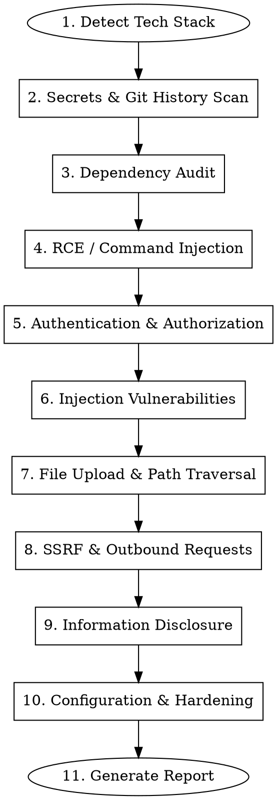

# Security Audit

A comprehensive, technology-agnostic security audit skill for codebases and their dependencies. Detects the project's tech stack automatically and runs all relevant checks.

## When to Use

- Before any deployment to production/staging
- During code reviews (invoke via `/security-audit`)
- After adding new dependencies
- After onboarding a new project
- When integrating third-party APIs or webhooks
- Periodically (monthly) as a health check
- After a security incident for root cause analysis

## Audit Flow



## How to Integrate

### Option A: Project-Level Skill (Recommended)

Place this file in your project so every developer gets it:

```
your-project/
  .claude/
    skills/
      security-audit/
        SKILL.md          <-- this file
```

### Option B: Global Skill (All Projects)

```
~/.claude/skills/
  security-audit/
    SKILL.md
```

### Option C: Pre-Commit Hook

Add to `.claude/settings.json` in your project:

```json
{
  "hooks": {
    "PreCommit": [
      {
        "matcher": "**/*.{ts,js,py,java,go,rs,php,rb}",
        "command": "echo 'Run /security-audit before pushing to remote'"
      }
    ]
  }
}
```

---

## Step 1: Detect Tech Stack

Before running checks, identify what you're auditing. Read project root for:

| File | Stack |
|------|-------|
| `nest-cli.json` or `@nestjs/core` in package.json | NestJS |
| `next.config.*` or `next` in package.json | Next.js |
| `package.json` (general) | Node.js |
| `requirements.txt` or `pyproject.toml` | Python |
| `manage.py` + `django` in requirements | Django |
| `app.py` + `flask` in requirements | Flask |
| `main.py` + `fastapi` in requirements | FastAPI |
| `pom.xml` or `build.gradle` | Java / Spring |
| `composer.json` | PHP / Laravel |
| `Gemfile` | Ruby / Rails |
| `go.mod` | Go |
| `Cargo.toml` | Rust |
| `*.csproj` or `*.sln` | .NET / C# |

Run ALL generic checks (Steps 2-10) regardless of stack. Run stack-specific checks within each step when applicable.

---

## Step 2: Secrets & Git History Scan

**This is always the #1 priority. Leaked secrets = game over.**

### 2.1 Check for Committed Secrets

```bash
# Check if .env files were ever committed
git log --all --oneline -- ".env" ".env.*" "*.pem" "*.key" "*.cert" "*.p12" "*.pfx"

# Search for secrets in git history
git log --all -p -S "SECRET_KEY" -- . | head -200
git log --all -p -S "API_KEY" -- . | head -200
git log --all -p -S "PASSWORD" -- . | head -200
git log --all -p -S "AWS_SECRET" -- . | head -200
git log --all -p -S "PRIVATE_KEY" -- . | head -200
```

### 2.2 Search for Hardcoded Secrets in Source Code

Search for these patterns across ALL source files:

| Pattern | What It Catches |
|---------|----------------|
| `password\s*=\s*['"][^'"]+['"]` | Hardcoded passwords |
| `api[_-]?key\s*=\s*['"][^'"]+['"]` | API keys |
| `secret\s*=\s*['"][^'"]+['"]` | Secrets |
| `token\s*=\s*['"][^'"]+['"]` | Tokens |
| `-----BEGIN (RSA\|EC\|DSA)? ?PRIVATE KEY-----` | Private keys |
| `AKIA[0-9A-Z]{16}` | AWS Access Key IDs |
| `sk-[a-zA-Z0-9]{48}` | OpenAI API keys |
| `ghp_[a-zA-Z0-9]{36}` | GitHub personal access tokens |
| `xox[bpas]-[a-zA-Z0-9-]+` | Slack tokens |

### 2.3 Check .gitignore Coverage

Verify these are gitignored:
- `.env`, `.env.*` (all variants)
- `*.pem`, `*.key`, `*.cert`
- `credentials/`, `secrets/`
- `node_modules/`, `__pycache__/`, `vendor/`, `target/`

### 2.4 Check for Fallback Default Values

Search for code where environment variables have real-looking fallback defaults:

```
# Dangerous patterns:
process.env.SECRET || 'actual-secret-value'
os.getenv('SECRET', 'actual-secret-value')
@Value("${secret:actual-secret-value}")
env('SECRET', 'actual-secret-value')
```

### Severity: CRITICAL if any real secret found in git history or source code.

---

## Step 3: Dependency Audit

### 3.1 Run Native Audit Tools

| Stack | Command |
|-------|---------|
| Node.js | `npm audit` or `yarn audit` |
| Python | `pip audit` or `safety check` |
| Java | `mvn dependency-check:check` or check OWASP |
| PHP | `composer audit` |
| Ruby | `bundle audit` |
| Go | `govulncheck ./...` |
| Rust | `cargo audit` |
| .NET | `dotnet list package --vulnerable` |

### 3.2 Check for Known Dangerous Packages

| Stack | Dangerous Packages |
|-------|-------------------|
| Node.js | `node-serialize`, `serialize-javascript` (old), `pdf-parse` (RCE CVE), `event-stream` (supply chain), any package with `eval` in postinstall |
| Python | `pickle` usage with untrusted data, `pyyaml` with `yaml.load()` (use `safe_load`), `jinja2` with `autoescape=False` |
| Java | `commons-collections` (deserialization), `log4j` < 2.17 (Log4Shell), `snakeyaml` with untrusted input |
| PHP | `unserialize()` with user input, outdated `phpmailer` |

### 3.3 Check for Malicious npm Lifecycle Hooks

```bash
# Node.js: Check for packages with install hooks that download binaries
grep -r "preinstall\|postinstall" package.json
# Check transitive dependencies:
npm query ':attr(scripts, [postinstall])' 2>/dev/null
npm query ':attr(scripts, [preinstall])' 2>/dev/null
```

### 3.4 Check for Typosquatting

Manually verify package names that look like popular packages but have slight misspellings.

### Severity: CRITICAL for known RCE CVEs. HIGH for packages with malicious install hooks.

---

## Step 4: Remote Code Execution (RCE) Vectors

**The most dangerous class of vulnerability. Any one of these = full server compromise.**

### 4.1 Shell Command Injection

Search for ALL of these patterns:

| Language | Dangerous Pattern | Safe Alternative |
|----------|------------------|-----------------|
| **Node.js** | `exec(userInput)`, `execSync(\`...\${var}\`)` | `execFileSync('cmd', [args])` (array form) |
| **Python** | `os.system(user_input)`, `subprocess.call(shell=True)` | `subprocess.run([cmd, arg], shell=False)` |
| **Java** | `Runtime.exec(userInput)` | `ProcessBuilder` with argument list |
| **PHP** | `exec($userInput)`, `system()`, `passthru()`, `shell_exec()`, `` `backticks` `` | `escapeshellarg()` + `escapeshellcmd()` |
| **Ruby** | `` `#{user_input}` ``, `system(user_input)` | `system('cmd', arg1, arg2)` (array form) |
| **Go** | `exec.Command("sh", "-c", userInput)` | `exec.Command("cmd", arg1, arg2)` |

**Key search terms:** `exec(`, `execSync`, `spawn(`, `system(`, `popen(`, `subprocess`, `shell_exec`, `passthru`, `child_process`, `os.system`, `Runtime.exec`

### 4.2 Code Evaluation

| Language | Dangerous | Severity |
|----------|-----------|----------|
| **JavaScript** | `eval()`, `new Function()`, `vm.runInNewContext()` | Critical |
| **Python** | `eval()`, `exec()`, `compile()` with user input | Critical |
| **Java** | `ScriptEngine.eval()`, OGNL expressions | Critical |
| **PHP** | `eval()`, `assert()`, `preg_replace` with `/e` flag | Critical |
| **Ruby** | `eval()`, `instance_eval`, `class_eval` with user input | Critical |

### 4.3 Unsafe Deserialization

| Language | Dangerous | Safe Alternative |
|----------|-----------|-----------------|
| **Node.js** | `node-serialize`, `unserialize()` | JSON.parse (safe for untrusted data) |
| **Python** | `pickle.loads(untrusted)`, `yaml.load(untrusted)` | `json.loads()`, `yaml.safe_load()` |
| **Java** | `ObjectInputStream.readObject()` with untrusted data | JSON/XML parsers, input validation |
| **PHP** | `unserialize($userInput)` | `json_decode()` |
| **Ruby** | `Marshal.load(untrusted)`, `YAML.load(untrusted)` | `JSON.parse()`, `YAML.safe_load()` |
| **.NET** | `BinaryFormatter.Deserialize()` | `System.Text.Json` |

### 4.4 Template Injection (SSTI)

| Framework | Check For |
|-----------|----------|
| **Jinja2** (Python) | User input in `render_template_string()` |
| **Twig** (PHP) | User input in `createTemplate()` |
| **EJS** (Node.js) | User input in template strings |
| **Thymeleaf** (Java) | User input in `th:text` with preprocessing `__${...}__` |
| **ERB** (Ruby) | User input in `ERB.new(user_input).result` |

### Severity: CRITICAL for any confirmed RCE vector.

---

## Step 5: Authentication & Authorization

### 5.1 Unprotected Endpoints

**This is the most common vulnerability.** Search for ALL route/endpoint definitions and verify each has authentication.

| Framework | How to Check |
|-----------|-------------|
| **NestJS** | Look for `@Controller` without `@UseGuards(AuthGuard)`. Check if there's a global `APP_GUARD`. |
| **Express** | Look for `app.get/post` without auth middleware in the chain |
| **Next.js** | Check `middleware.ts` for auth. Check API routes in `app/api/` for session validation |
| **Django** | Look for views without `@login_required` or `permission_classes` |
| **Flask** | Look for routes without `@login_required` |
| **FastAPI** | Look for endpoints without `Depends(get_current_user)` |
| **Spring** | Check `SecurityFilterChain` config. Look for endpoints without `@PreAuthorize` |
| **Laravel** | Check `routes/web.php` and `routes/api.php` for routes without `->middleware('auth')` |
| **Rails** | Check controllers without `before_action :authenticate_user!` |
| **Go** | Check HTTP handler registration for missing auth middleware |

**Prefer global auth with explicit opt-out** (allowlist) over per-route auth (denylist).

### 5.2 Social Login / OAuth Verification

If social login exists (Google, Facebook, Apple, GitHub):
- Is the OAuth token verified SERVER-SIDE with the provider's API?
- Or does the server trust the client-provided email/identity? (CRITICAL vulnerability)

### 5.3 JWT / Token Issues

| Check | Why |
|-------|-----|
| `jwt.decode()` used without `jwt.verify()` | Payload parsed without signature check — token forgery |
| Same secret for all token types | Access token used as refresh token or vice versa |
| Weak/default JWT secret | `secret`, `changeme`, `your-secret-here` |
| No token expiration | Stolen token works forever |
| Token in URL query string | Logged in server access logs, browser history |

### 5.4 Mass Assignment

Check if user input can set privileged fields:

```
# Dangerous: User can set their own role
POST /api/users { "name": "attacker", "role": "admin" }
```

| Framework | Check |
|-----------|-------|
| NestJS | DTOs with `role`, `isAdmin`, `permissions` fields. Check `whitelist: true` in ValidationPipe |
| Django | `ModelSerializer` with `fields = '__all__'` |
| Rails | `params.permit` — is it too permissive? |
| Laravel | `$fillable` vs `$guarded` on models |
| Spring | `@ModelAttribute` binding without `@InitBinder` restrictions |

### 5.5 Broken Access Control (IDOR)

Look for endpoints that access resources by sequential numeric ID without ownership checks:

```
GET /api/documents/123        # Can user A access user B's document?
DELETE /api/documents/123     # Can user A delete user B's document?
```

**Every endpoint that takes an ID must verify the requesting user owns that resource.**

### Severity: CRITICAL for auth bypass, account takeover, unprotected admin endpoints. HIGH for IDOR.

---

## Step 6: Injection Vulnerabilities

### 6.1 SQL Injection

| Framework | Dangerous Pattern | Safe Pattern |
|-----------|------------------|-------------|
| **Raw SQL** (any) | `"SELECT * FROM users WHERE id = " + userId` | Parameterized: `"SELECT * FROM users WHERE id = ?"` |
| **Sequelize** | `Sequelize.literal(userInput)`, `sequelize.query(\`...${var}\`)` | `Model.findAll({ where: { id } })` |
| **TypeORM** | `createQueryBuilder().where(\`id = ${var}\`)` | `.where("id = :id", { id })` |
| **Django ORM** | `raw(f"SELECT ... {user_input}")` | `Model.objects.filter(id=user_input)` |
| **SQLAlchemy** | `text(f"SELECT ... {var}")` | `text("SELECT ... :var").bindparams(var=val)` |
| **JPA** | `createQuery("... " + userInput)` | `createQuery("... :param").setParameter("param", val)` |
| **Laravel** | `DB::raw($userInput)` | `DB::table('users')->where('id', $id)` |
| **ActiveRecord** | `where("id = #{params[:id]}")` | `where(id: params[:id])` |

### 6.2 NoSQL Injection

| Database | Dangerous | Safe |
|----------|-----------|------|
| **MongoDB** | `{ $where: userInput }`, `{ password: { $ne: null } }` | Validate input types, use `$eq` explicitly |
| **Mongoose** | `Model.find(req.body)` (passes raw object) | Sanitize with `mongo-sanitize` |

### 6.3 Log Injection

Check if user input is written to logs without sanitization. An attacker can inject fake log lines:

```
# Dangerous:
logger.info(`User login: ${username}`);
# Attacker sends username: "admin\n[INFO] User login: admin - SUCCESS"
```

### 6.4 Header Injection

Check if user input flows into HTTP response headers (especially `Location`, `Set-Cookie`).

### Severity: CRITICAL for SQL injection. HIGH for NoSQL injection. MEDIUM for log/header injection.

---

## Step 7: File Upload & Path Traversal

### 7.1 Upload Validation

For every file upload endpoint, check ALL of these:

| Check | Why |
|-------|-----|
| **File size limit at framework level** | Without it, attacker can exhaust server memory before app-level validation runs |
| **MIME type validation** | Client-sent `Content-Type` is attacker-controlled — validate actual file content with magic bytes |
| **File extension allowlist** | Block `.php`, `.jsp`, `.sh`, `.py`, `.js`, `.exe`, `.bat`, `.cmd` |
| **MIME-extension match** | A `.sh` file with `Content-Type: application/pdf` should be rejected |
| **Filename sanitization** | Strip `../`, null bytes, special characters from filenames |
| **Storage location** | Uploaded files must NOT be in web-accessible executable directories |

### 7.2 Path Traversal

Search for file system operations where user input influences the file path:

```
# Dangerous patterns (any language):
readFile(userInput)
path.join(baseDir, userInput)   # ../../../etc/passwd
open(user_provided_path)
send_file(user_input)
```

**Fix:** Resolve the path and verify it stays within the allowed directory:

```javascript
const resolved = path.resolve(baseDir, userInput);
if (!resolved.startsWith(path.resolve(baseDir))) {
  throw new Error('Path traversal detected');
}
```

### Severity: HIGH for unrestricted upload. HIGH for path traversal.

---

## Step 8: SSRF (Server-Side Request Forgery)

### 8.1 Find Outbound HTTP Calls with User-Controlled URLs

Search for any code that makes HTTP requests where the URL comes from user input:

| Language | HTTP Client Libraries |
|----------|----------------------|
| **Node.js** | `axios`, `fetch`, `node-fetch`, `got`, `http.get`, `https.get`, `request` |
| **Python** | `requests`, `urllib`, `httpx`, `aiohttp` |
| **Java** | `HttpClient`, `RestTemplate`, `WebClient`, `OkHttp`, `URL.openConnection()` |
| **PHP** | `curl_exec`, `file_get_contents`, `fopen` with URL |
| **Ruby** | `Net::HTTP`, `HTTParty`, `Faraday`, `open-uri` |
| **Go** | `http.Get`, `http.Post`, `http.Client` |

### 8.2 Check for SSRF Protections

If the application accepts URLs from users (webhooks, callbacks, imports, profile images):

| Check | Why |
|-------|-----|
| Blocks private IPs (10.x, 172.16-31.x, 192.168.x, 127.x, 169.254.x) | Prevents access to internal services |
| Blocks `0.0.0.0`, `::1`, `::ffff:` mapped addresses | IPv6 bypasses |
| Blocks cloud metadata (`169.254.169.254`) | AWS/GCP/Azure credential theft |
| Validates at request time (not just at registration) | Prevents DNS rebinding |
| Disables redirects (`maxRedirects: 0`) | Prevents redirect-to-internal bypass |
| Does NOT store response body | Prevents data exfiltration |

### 8.3 AWS-Specific: Instance Metadata

If running on AWS, check if IMDSv2 is enforced:
```bash
aws ec2 describe-instances --instance-id <id> --query 'Reservations[].Instances[].MetadataOptions'
# HttpTokens should be "required" (IMDSv2)
```

### Severity: CRITICAL if SSRF can reach cloud metadata. HIGH otherwise.

---

## Step 9: Information Disclosure

### 9.1 API Documentation Exposure

| Framework | Check |
|-----------|-------|
| **NestJS/Swagger** | Is `/api/docs`, `/swagger`, `/swagger.json` accessible without auth in production? |
| **FastAPI** | Is `/docs`, `/redoc`, `/openapi.json` accessible? |
| **Spring** | Is `/swagger-ui.html`, `/v3/api-docs` accessible? |
| **Laravel** | Is any API documentation route publicly accessible? |
| **Django REST** | Is the browsable API enabled in production? |

**Fix:** Disable API documentation in production or protect it behind authentication.

### 9.2 Error Message Leakage

Check if stack traces, database errors, or internal paths are returned in API responses:

```
# Dangerous:
{ "error": "SequelizeDatabaseError: relation 'users' does not exist", "stack": "..." }

# Safe:
{ "error": "An unexpected error occurred. Please try again." }
```

### 9.3 Health Endpoints

Check if health/status endpoints expose infrastructure details (DB status, memory usage, disk space, versions) without authentication.

### 9.4 Debug Mode in Production

| Framework | Check |
|-----------|-------|
| **Node.js** | `NODE_ENV !== 'production'` |
| **Django** | `DEBUG = True` in settings |
| **Flask** | `app.run(debug=True)` |
| **Laravel** | `APP_DEBUG=true` in `.env` |
| **Spring** | `spring.profiles.active` not set to `prod` |
| **Rails** | `config.consider_all_requests_local = true` |

### 9.5 Console.log / Debug Logging

Search for `console.log`, `print()`, `System.out.println` that output sensitive data (tokens, passwords, user IDs, internal state) in production code.

### Severity: HIGH for Swagger/debug exposure in production. MEDIUM for verbose errors. LOW for debug logs.

---

## Step 10: Configuration & Hardening

### 10.1 Security Headers

Check that these headers are set:

| Header | Value | Purpose |
|--------|-------|---------|
| `X-Frame-Options` | `DENY` or `SAMEORIGIN` | Prevent clickjacking |
| `X-Content-Type-Options` | `nosniff` | Prevent MIME sniffing |
| `Strict-Transport-Security` | `max-age=31536000; includeSubDomains` | Force HTTPS |
| `Content-Security-Policy` | No `unsafe-inline`, no `unsafe-eval` | Prevent XSS |
| `Referrer-Policy` | `strict-origin-when-cross-origin` | Limit referrer leakage |
| `Permissions-Policy` | `camera=(), microphone=(), geolocation=()` | Restrict browser APIs |

### 10.2 CORS Configuration

Check that CORS is not set to `*` (allow all origins) in production. Should be an explicit allowlist.

### 10.3 Rate Limiting

- Is rate limiting enabled globally?
- Are sensitive endpoints (login, register, forgot-password, OTP) rate-limited more aggressively?
- Is rate limiting backed by persistent storage (Redis), not in-memory?

### 10.4 HTTPS / TLS

- Is HTTPS enforced in production?
- Are database connections encrypted (SSL/TLS)?
- Are connections to external services (email, APIs) over TLS?

### 10.5 Environment Variable Validation

Does the application validate that all required environment variables are set before starting? Missing vars (especially secrets) should crash the app at startup, not silently use `undefined`.

### 10.6 Cryptographic Security

| Check | Bad | Good |
|-------|-----|------|
| Random number generation | `Math.random()`, `random.random()` | `crypto.randomInt()`, `secrets.token_hex()` |
| Password hashing | MD5, SHA1, SHA256 (unsalted) | bcrypt, argon2, scrypt |
| OTP generation | Predictable PRNG | Cryptographic PRNG (`crypto.randomInt`) |
| Encryption | ECB mode, DES, RC4 | AES-256-GCM, ChaCha20-Poly1305 |

### Severity: MEDIUM for most configuration issues. HIGH for missing rate limiting on auth endpoints.

---

## Report Template

After completing all checks, generate a report in this format:

```markdown
# Security Audit Report — [Project Name]

**Date:** [date]
**Tech Stack:** [detected technologies]
**Auditor:** Claude Code Security Audit Skill

## Summary
| Severity | Count |
|----------|-------|
| Critical | X |
| High     | X |
| Medium   | X |
| Low      | X |

## Findings

### [ID]: [Title]
| Field | Detail |
|-------|--------|
| Severity | Critical / High / Medium / Low |
| Category | RCE / Auth / Injection / SSRF / etc. |
| File | path/to/file:line |

**Description:** What the vulnerability is.
**Attack Scenario:** How an attacker exploits it.
**Fix:**
[code block with before/after]

## Remediation Priority
| Phase | Tasks |
|-------|-------|
| Before deployment | ... |
| This week | ... |
| Next sprint | ... |
```

---

## Common Mistakes

| Mistake | Why It's Wrong |
|---------|---------------|
| Only auditing your own code | Dependencies and transitive deps are attack surface too |
| Trusting client-provided MIME types | `Content-Type` header is attacker-controlled |
| Checking URL safety at registration time only | DNS can change between check and use (DNS rebinding) |
| Using `decode()` instead of `verify()` for JWTs | Parses token without checking signature |
| Auth as opt-in (per-route) | Developers forget. Use global guard + explicit `@Public()` opt-out |
| Storing secrets in git, then deleting the file | `git log` preserves everything. Must rewrite history with BFG |
| Using `Math.random()` / `random.random()` for security | Predictable PRNG. Use `crypto.randomInt()` / `secrets` module |
| `execSync` with string interpolation | Command injection. Use `execFileSync` with array arguments |
| Disabling SSL validation (`rejectUnauthorized: false`) | MITM attacks. Fix the certificate instead |
| Returning `error.message` to the client | Leaks internal details (DB errors, stack traces) |
